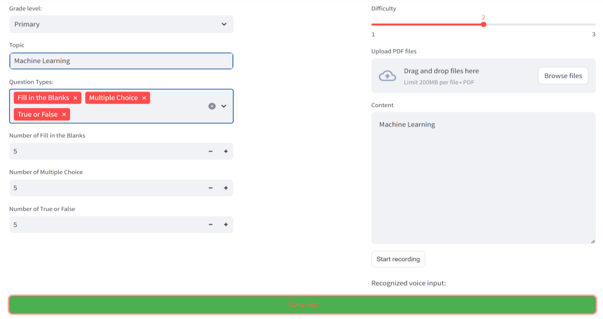
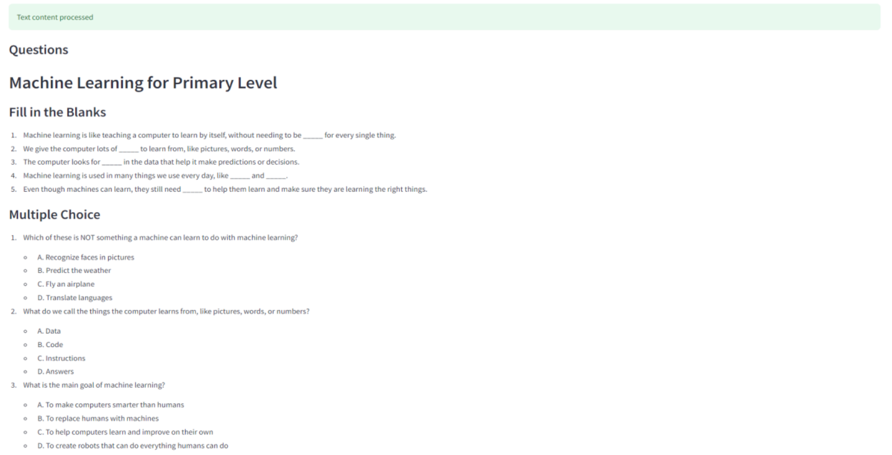

# Worksheet Generator

# Description

The Worksheet Generator project automates the creation of customized lesson plans, advancing the application of AI in education. With the use of inputs such as grade level, question type, and topic matter, this application uses an advanced Large Language Model (LLM) to generate challenging and relevant content. This project creatively reduces the workload for teachers by automating the creation of a variety of instructional resources, including true-or-false, fill-in-the-blank, and open-ended questions with an answer key. By enabling teachers to spend more time with students and less time on tedious lesson planning duties, the Worksheet Generator hopes to improve the quality of education for all students.

# Step 1: 

### Setting Up Google Cloud Infrastructure

1. Create a Google Cloud Account
o Provide billing information to access GCP free trial credits.

2. Initiate a New Google Cloud Project

3. Enable Vertex AI Services
o Enable the necessary APIs for Vertex AI.

4. Establish a Service Account
o Assign 'owner' permissions to the service account.
o Generate a key for the service account.

# Step 2: 

### Configuring the Development Environment

1. Clone the Project Repository
o Use your terminal to clone the repository:
git clone https://github.com/radicalxdev/mission-worksheet-generator.git

2. Incorporate Service Account Key
o Add the service account key to the local repository.
o Ensure the .gitignore file excludes the key for security.

3. Authenticate with Google Cloud
o Export the service account key for authentication:
export
GOOGLE_APPLICATION_CREDENTIALS='path_to_service_account_key.json'
o Verify the path and permissions if errors occur.

# Step 3: 

### Document Upload and Ingestion

1. Implement File Uploader Widget
o Add a file uploader in Streamlit to accept PDF files:
files = st.file_uploader("Upload PDF files", type="pdf", accept_multiple_files=True)

2. Process Uploaded PDFs
o Use PyPDFLoader to load and extract pages from PDFs:
from langchain.document_loaders import PyPDFLoader
def load_pdf(file):
 loader = PyPDFLoader(file)
 return loader.load_and_split()

3. Update DocumentProcessor
o Add the extracted pages to the pages class variable in DocumentProcessor.

4. Verify Document Ingestion
o Use streamlit run to ensure documents can be ingested and processed.
Step 4: Initializing the Embedding Engine
1. Define Initialization Method
o Implement the __init__ method to accept parameters model_name, project, and 
location.
2. Initialize Vertex AI Client
o Initialize self.client as an instance of VertexAIEmbeddings.
3. Test Embedding Initialization
o Use streamlit run to preview the embedding initialization.

# Step 5: 

### Data Processing and Storage

1. Check Processed Documents
o Ensure documents have been processed by DocumentProcessor.

2. Divide Documents into Chunks
o Use CharacterTextSplitter to split documents into chunks suitable for embedding:
 from langchain.text_splitter import CharacterTextSplitter

3. Create In-Memory Chroma Collection
o Create a Chroma collection using Chroma.from_documents with the text chunks.

4. Verify Chroma Collection Creation
o Use streamlit run to test ChromaDB and ensure the collection is created.

# Step 6: 

### Streamlit Interface for Data Handling

1. Initialize DocumentProcessor
o Instantiate DocumentProcessor and call ingest_documents() to process PDFs.

2. Configure Embedding Client
o Initialize EmbeddingClient with model, project, and location parameters.

3. Create ChromaCollectionCreator
o Instantiate ChromaCollectionCreator using the initialized DocumentProcessor and 
EmbeddingClient.

4. Design User Input Form
o Use Streamlit to create a form for users to input worksheet details and select question 
types.

5. Generate Chroma Collection
o Create a Chroma collection from processed documents after form submission.

6. Enable Query-Based Retrieval
o Allow users to input a query and retrieve relevant information from the Chroma 
collection.

# Step 7: 

### Worksheet Creation Engine

1. Develop Worksheet Generator
o Implement the generate_worksheet() method to create worksheets based on input 
criteria.

2. Configure Generation Parameters
o Set parameters like temperature and max_output_tokens to control the generation 
process.

3. Generate Questions and Answers
o Use generate_question_with_vectorstore() to create questions and validate their 
uniqueness.

4. Compile Unique Questions
o Return the compiled list of unique worksheet questions.

# Step 8: 

### Worksheet Generation Workflow

1. Iterate Through Questions
o Loop through the desired number of questions to generate each one.

2. Ensure Question Uniqueness
o Use validate_question() to ensure each question is unique.

3. Implement Retry Mechanism
o Implement a retry limit to avoid infinite loops during question generation.

4. Finalize Worksheet
o Return the final list of unique worksheet questions.

# Step 9: 

### Streamlit User Interface for Worksheet

1. Store Questions in Session State
o Store the list of worksheet questions and total number of questions in Streamlit's 
session state.

2. Implement Question Navigation
o Add navigation functions to move between questions.

3. Display Questions
o Use Streamlit components to display questions and handle user interactions.

# Step 10: 

### Managing Screen State

1. Initialize Session State Variables
o Initialize variables like question_bank and question_index in session state.

2. Capture User Inputs
o Use Streamlit widgets to capture user inputs for topic and number of questions.

3. Navigate Quiz Questions
o Implement logic for navigating through questions using methods from 
WorksheetManager.

4. Test the Application
o Use streamlit run to test the application, upload a small PDF, and preview generated 
questions

**Contributer** -
**Shreyas Waikar**

- [LinkedIn](https://www.linkedin.com/in/connect-with-shreyas-waikar/)
- [GitHub](https://github.com/sdwaikar)